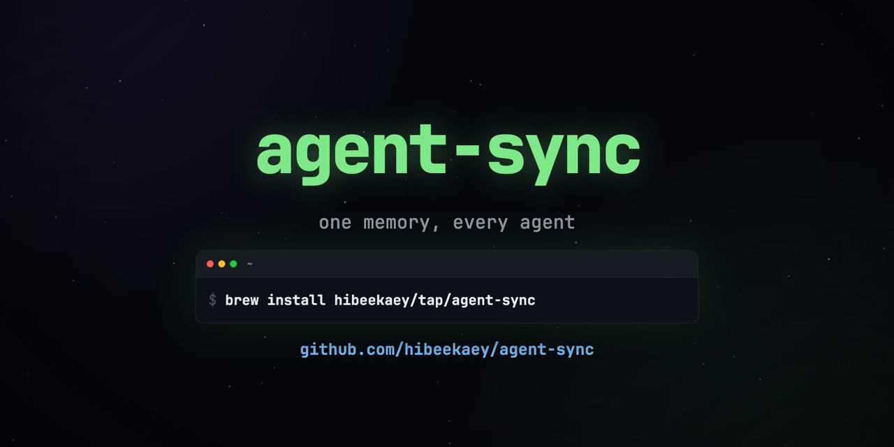

# agent-sync



**One memory, every agent.** Synchronize your AI coding agents' memory, so
you can stop in one agent and pick up in another.

[](https://github.com/hibeekaey/agent-sync/actions/workflows/ci.yml)
[](https://github.com/hibeekaey/agent-sync/releases)
[](LICENSE)
[](bin/agent)
[](#install)
[](https://github.com/hibeekaey/agent-sync/commits/main)
[](https://github.com/hibeekaey/agent-sync/stargazers)


Every coding agent accumulates knowledge about you and your projects: Claude
Code writes memory files, Codex keeps a memory store, Goose keeps memories,
Cursor and Continue collect rules. Each lives in its own silo, so switching
agents means starting over. `agent sync` breaks the silos with a three-stage
round trip:

1. **Gather**: read every agent's own memory stores.
2. **Synthesize**: fold them into one synthesized memory file. Claude does
   the semantic merge when available, then Codex; if neither is usable, the
   deterministic marker-delimited merge remains.
3. **Redistribute**: write the result to every installed agent's global
   instructions slot.

After a sync, every agent knows what every agent has learned. Unlike
one-way rules generators, the loop is bidirectional: what your agents learn
flows back into the canon.

| Verb | What it does |
| --- | --- |
| `agent sync [--synthesizer MODE] [--dry-run]` | The full round trip: gather, synthesize, redistribute |
| `agent status` | Parity check; exit 1 if any agent is stale (cron-friendly) |
| `agent diff` | Stale targets as unified diffs; exit 1 on drift (CI gate) |
| `agent doctor` | Diagnose the setup and report problems |
| `agent migrate <agent>` | Fold just one agent's stores in, then redistribute |
| `agent gather [dir]` | Stage all stores into a directory for editing and review |
| `agent apply [dir] [--synthesizer MODE] [--dry-run] [--only LIST] [--skip LIST]` | Push edited staged files back to their stores, then run the full sync |
| `agent link [dir] [--import]` | Make one project-scope `AGENTS.md` readable by every agent in a repo; `--import` folds the repo's native per-tool configs into it |
| `agent revert` | Restore `.orig` adoption backups and the synthesized file's `.bak` |
| `agent pack add owner/repo[@ref][:dir]` | Shareable memory packs, pinned to a commit in a lockfile, folded in on every sync |
| `agent mcp add/remove/sync` | One MCP server registry pushed to every tool, with applied-state tracking for safe updates and removals |
| `agent skills sync` | Additively synchronize canonical skills without overwriting unmanaged collisions |
| `agent hooks [tool]` | Print verified automation snippets (Claude/Codex/Gemini hooks, an OpenCode plugin) |
| `agent targets` | List targets and detection state |

Target filtering: `--only claude,codex` / `--skip qwen` flags on `sync` and
`apply`; the `AGENT_SYNC_ONLY` / `AGENT_SYNC_SKIP` environment variables
additionally apply to `status`, `diff`, `skills sync` and `mcp sync`.

The edit loop: `agent gather`, edit the staged files in one place, `agent
apply`. Your edits land back in each agent's own store, get folded into the
synthesized file, and are redistributed to every agent.

Every command with real output, end to end:
[docs/walkthrough.md](docs/walkthrough.md).

**Safety:** the first time sync would overwrite a pre-existing file it did
not write, the original is preserved beside it as `<file>.orig`, and `agent
revert` restores everything. `apply` validates every manifest entry against
the supported memory-store paths and rejects path traversal and symlinks.
Pack subdirectories must resolve inside the downloaded repository. MCP files
are written through private atomic temporary files, and CLI-managed MCP
updates validate before replacement and restore the recorded configuration if
replacement fails. Skill directories are replaced only after agent-sync has
recorded ownership; an unmanaged same-name skill is reported and left alone.

## Install

With the installer (pinned release, checksum-verified):

```sh
curl -fsSL https://raw.githubusercontent.com/hibeekaey/agent-sync/main/install.sh | sh
# or, per-user without sudo:
curl -fsSL https://raw.githubusercontent.com/hibeekaey/agent-sync/main/install.sh | PREFIX=$HOME/.local sh
```

With Homebrew:

```sh
brew install hibeekaey/tap/agent-sync

# Upgrading: brew only refreshes taps once per HOMEBREW_AUTO_UPDATE_SECS
# (24 hours by default), so a fresh release can look like "not outdated"
# until the tap is fetched.
brew update && brew upgrade agent-sync
```

From a clone (installs the man page and completions too):

```sh
make install                 # /usr/local (may need sudo)
make install PREFIX=~/.local # per-user, no sudo
```

POSIX sh only, using standard Unix utilities available on macOS and Linux.
Memory packs require `curl` and `tar`; semantic synthesis requires a configured
Claude Code or Codex CLI unless deterministic mode is selected.

## Supported agents

Global scope (`agent sync` writes the synthesized file here):

| Agent | Reads the synced file at | Memory stores gathered from |
| --- | --- | --- |
| Claude Code | `~/.claude/CLAUDE.md` (the synthesized file itself) | `~/.claude/projects/*/memory/*.md` |
| Codex CLI | `~/.codex/AGENTS.md` | `~/.codex/memories/*.md` |
| Gemini CLI / Antigravity | `~/.gemini/GEMINI.md` | — |
| Qwen Code | `~/.qwen/QWEN.md` | — |
| Continue | `~/.continue/rules/best-practices.md` | `~/.continue/rules/*.md` |
| Windsurf | `~/.codeium/windsurf/memories/global_rules.md` | `~/.codeium/windsurf/memories/*.md` |
| Cursor | `~/.cursor/rules/best-practices.mdc` (generated `.mdc`) | `~/.cursor/rules/*.mdc` |
| OpenCode | `~/.config/opencode/AGENTS.md` | — |
| Amp | `~/.config/amp/AGENTS.md` | — |
| Goose | `~/.config/goose/.goosehints` | `~/.config/goose/memory/*` |
| GitHub Copilot CLI | `~/.copilot/copilot-instructions.md` | — |
| Zed | `~/.config/zed/AGENTS.md` | — |
| JetBrains Junie | `~/.junie/AGENTS.md` | — |
| Kiro | `~/.kiro/steering/agent-sync.md` | — |
| Crush | `~/.config/crush/CRUSH.md` | — |
| Roo Code | `~/.roo/rules/agent-sync.md` | — |
| Cline | `~/Documents/Cline/Rules/agent-sync.md` | — |

Every path above was verified against the tool's official documentation.
Tools are detected by their config directory; absent tools are skipped, so
the same binary serves every machine. Files agent-sync generates are never
gathered, so the tool cannot feed on its own output. Aider is deliberately
absent: it has no global instructions mechanism; point `read:` in
`~/.aider.conf.yml` at the synthesized file yourself.

Project scope (`agent link`): one repo-root `AGENTS.md` — the
[AGENTS.md standard](https://agents.md) is read natively by Codex, Cursor,
Copilot, Zed, Amp, OpenCode, Junie, Goose, Jules and others. `link` seeds
it (from an existing `CLAUDE.md` when present), bridges Claude Code with the
officially documented `@AGENTS.md` import stub, and configures Gemini CLI's
`context.fileName` (which does not read `AGENTS.md` by default).

## Semantic synthesis

`agent sync` automatically selects a semantic synthesizer. The same
selection is used by the full sync at the end of `agent apply`.

Automatic mode sends the synthesized memory document to the locally
configured Claude Code account, then Codex if Claude is unavailable or fails.
Use `--synthesizer deterministic` when the document must stay entirely local.

| Selection | Behaviour |
| --- | --- |
| `auto` (default) | Try Claude, then Codex, then retain the deterministic merge |
| `claude` / `codex` | Require that CLI and use its configured default model |
| `deterministic` | No model; refreshed marker-delimited imports |
| Custom command | `AGENT_SYNC_SYNTHESIZER` reading a prompt on stdin, printing the document |

```sh
agent sync
agent sync --synthesizer deterministic
AGENT_SYNC_SYNTHESIZER='claude -p' agent sync
```

CLI selection overrides the environment. Model calls are non-interactive
(Claude runs without session persistence; Codex runs ephemerally in a
read-only sandbox), output is validated (a heading first, at least a quarter
of the document's lines, and every real URL, hostname, environment variable
and long id of the document still present), the previous file is kept at
`<file>.bak`, and every failure falls through toward the deterministic
merge. A recursion guard stops a synthesizer-spawned agent from re-entering
agent-sync.

## Keeping the file small

The synthesized file is read into every session on every tool, so its size
is paid on every turn, and the deterministic merge grows it by the full text
of every memory store on every sync. `agent compact` keeps it under a byte
budget (150 KB by default, `AGENT_SYNC_BUDGET` or `--budget` to change it):

```sh
agent compact             # exits at once while the file is within budget
agent compact --dry-run   # the plan: which sections shrink, to what size
agent compact --force     # compact anyway
agent compact --jobs 8    # rewrite eight sections at a time (default 4)
```

When the file is over budget, each raw imported section is promoted into
curated notes (`## Promoted from claude`) and its store files are archived
to `~/.config/agent-sync/archive/` and removed, so the next sync has nothing
to re-import. Then every curated section of 2 KB or more is rewritten
shorter by the model, one section at a time. A rewrite may forget how a
lesson was learned, items marked settled, refuted, muted or parked, one-off
references (commit shas, PR numbers, run ids, past versions) and anything
else of low value, but it is refused and the section kept unless it starts
with the same heading, is at least a quarter of the original, and still
contains every real URL, hostname, environment variable and long id the
original had: those route traffic or unlock access and cannot be re-derived,
while paths, commands and code words are asked for but may go with a story
the rewrite forgets. A rewrite that
drops one gets a second attempt naming what it lost. `--keep-all` forbids
forgetting and protects every backtick span and bare letter-and-digit
token. `sync` reports the size after every run; `status`
and `doctor` fail while the file is over budget. `compact` needs a model and
rejects `--synthesizer deterministic`.

## Automating

Cron staleness gate:

```sh
0 9 * * * agent status || osascript -e 'display notification "agent memory is stale" with title "agent-sync"'
```

Size gate, weekly by cron or daily by launchd on macOS (`agent hooks launchd`
prints the plist; the run costs a model call only when the file has grown
past its budget):

```sh
0 9 * * 1 agent compact
```

CI drift gate (fails the build when instructions drifted):

```sh
agent diff
```

Claude Code hook that re-syncs whenever the canon is edited:

```json
{
  "hooks": {
    "PostToolUse": [{
      "matcher": "Edit|Write",
      "hooks": [{
        "type": "command",
        "command": "f=$(jq -r \".tool_input.file_path // empty\"); if [ \"$f\" = \"$HOME/.claude/CLAUDE.md\" ]; then agent sync --synthesizer deterministic; fi"
      }]
    }]
  }
}
```

## Coordinating agents on one task

Shared memory makes cross-agent handoffs coherent; the file-mediated
protocol for splitting work between two agents (headless invocation, task
directories, mkdir locks, git worktrees) is documented in
[docs/coordination.md](docs/coordination.md), including a verified
Claude Code to Codex round trip.

The same protocol ships as an installable coordinator skill at
[skills/coordinate-agents](skills/coordinate-agents/SKILL.md). Install it
with [`gh skill`](https://github.com/github/gh-skill) into whichever agent
should play coordinator:

```sh
gh skill install hibeekaey/agent-sync coordinate-agents \
  --agent claude-code \
  --scope user
```

To pin a specific version, add `--pin vX.Y.Z` using any agent-sync release
tag; the skill ships with the CLI and shares its version line. Without `gh`,
copying `skills/coordinate-agents/` into your agent's skills directory works
too.

## MCP, skills, packs and hooks

Beyond memory, `agent` syncs the rest of your agent setup:

- **MCP servers** (`agent mcp`): register a server once, push it everywhere.
  Tools with an MCP CLI get it through their own CLI (`claude mcp add-json`,
  `codex mcp add`, `gemini`/`qwen` `mcp add`, `amp mcp add`); tools with a
  dedicated MCP file get an agent-sync-owned file (Cursor `~/.cursor/mcp.json`,
  Windsurf `mcp_config.json`, Kiro `settings/mcp.json`), never touched if you
  created it yourself. Tools that keep MCP inside shared settings (Zed,
  OpenCode, Goose, Continue) get a printable snippet instead of risky edits.
  CLI entries successfully applied by agent-sync are tracked so later updates
  can validate and roll back, and removal from the registry is propagated on
  the next sync. Entries first installed before v1.5.2 may require one manual
  removal. MCP environment values and headers can be secrets: registry files
  are private, and `agent mcp snippet` deliberately prints them for pasting.
  Every command grammar and file shape was verified against official docs.
- **Skills** (`agent skills sync`): additively synchronize `~/.claude/skills`
  (or `AGENT_SYNC_SKILLS_SOURCE`) into every agent's user-scope skills
  directory, following the `gh skill` agent registry mapping. Target-only
  skills remain. Identical copies are adopted, agent-sync-owned copies update
  atomically, and conflicting unmanaged copies are left untouched with a
  nonzero exit.
- **Memory packs** (`agent pack`): install shareable markdown packs from any
  GitHub repo, pinned to a commit in a lockfile, folded into the synthesized
  file on every sync and cleanly removable.
- **Hooks** (`agent hooks`): verified snippets that keep memory fresh
  automatically (Claude Code `SessionEnd`, Codex `Stop`, Gemini `AfterAgent`,
  an OpenCode plugin under `~/.config/opencode/plugin`), printed for you to
  paste, never installed behind your back.

## Roadmap

- Hook-based automatic session capture into the canon (beyond re-sync)
- Per-agent content overrides (vary sections per tool)
- Native Windows (PowerShell) port; WSL is supported today
  ([docs/windows.md](docs/windows.md))

## Notes

| Item | Note |
| --- | --- |
| Privacy | Memory files and MCP credentials can contain private context. Keep the synthesized file, gathered output, MCP state and snippets out of public repositories; deterministic synthesis keeps memory out of model calls. |
| Synthesized source | `AGENT_SYNC_SOURCE` overrides its location. When it lives elsewhere, sync redistributes it to Claude too. |
| Test isolation | `AGENT_SYNC_HOME` points the tool at a fixture root; `make test` never touches your real config. |
| Colour | Status output is coloured on a terminal and plain everywhere else, so pipes, cron and CI keep the exact bytes they had. `--no-color` or `NO_COLOR` turns it off; `--color=always` or `FORCE_COLOR` keeps it through a pipe or a pager. Escapes never reach a file. |
| Walkthrough | Every command with real output: [docs/walkthrough.md](docs/walkthrough.md). |
| Manual | `man agent` after `make install`, or `agent help`. |
| Compatibility | Supported platforms, what agent-sync depends on in each tool, versioning and the deprecation policy: [docs/compatibility.md](docs/compatibility.md). |

## Contributing

Contributions are welcome, especially support for new agents (see the
[feature request template](.github/ISSUE_TEMPLATE/feature_request.md) for
what a new target needs). Start with [CONTRIBUTING.md](CONTRIBUTING.md);
this project follows a [Code of Conduct](CODE_OF_CONDUCT.md) and takes
security reports privately per [SECURITY.md](SECURITY.md).

## Support the project

If agent-sync saves you from re-teaching your agents who you are:

- **Star the repo.** It genuinely helps others find it.
- **Share it** with someone juggling more than one coding agent.
- **[Sponsor](https://github.com/sponsors/hibeekaey)** if it earns a place
  in your daily loop.

## License

[MIT](LICENSE)
